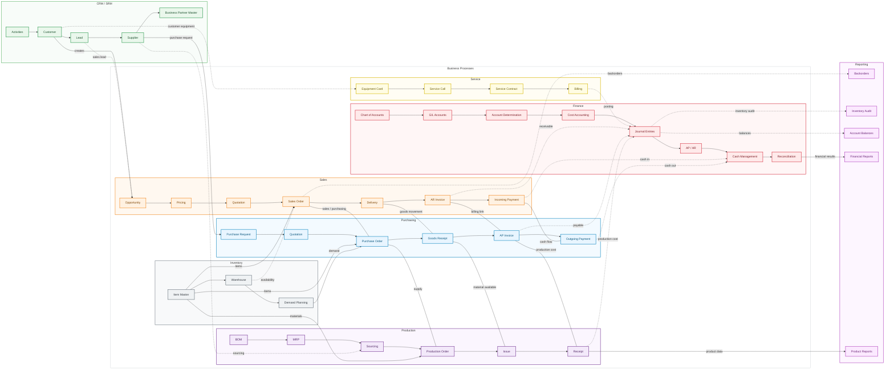

# Actividad 01 - Diagrama de Procesos

Diagrama de procesos realizado con Mermaid para la materia Sistemas ERP.

## Diagrama

## Archivo fuente

El archivo fuente del diagrama se encuentra en [`diagrama_procesos.mmd`](./diagrama_procesos.mmd).
